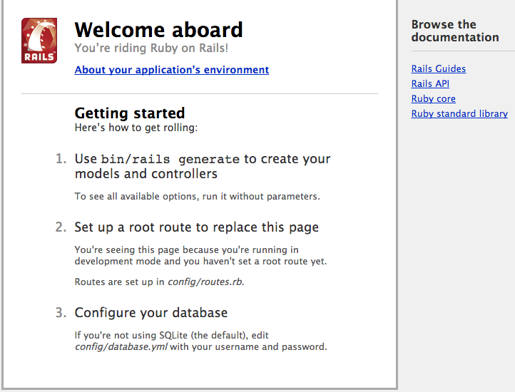

# 写码道场 #

## 环境准备 ##

我们使用Docker来部署统一的Ruby on Rails开发环境。

首先，根据你的操作系统选择参考 [Windows](https://docs.docker.com/engine/installation/windows/)(7+)、[Mac OS X](https://docs.docker.com/mac/step_one/)或[Linux](https://docs.docker.com/linux/step_one/)文档，安装好Docker。

然后执行下面命令创建开发用的镜像（以Mac OS X为例）：

```
# 启动Docker
$ docker-machine create --driver virtualbox default
$ docker-machine env default
$ eval "$(docker-machine env default)"


# 获取开发使用的镜像
$ docker pull gaoermai/ruby-devel:0.0.2
$ docker tag gaoermai/ruby-devel:0.0.2 dojo/ruby-devel:latest


# 启动容器
$ mkdir ~/dojo ; cd ~/dojo
$ git clone https://github.com/gaoermai/coding-dojo.git
$ ./coding-dojo/bin/start_devel
```

如果一切顺利的话，打开浏览器输入```http://192.168.99.100:3000/```，你会看到以下界面：



如果你不知道IP，可以通过命令```docker-machine ip default```获得。

## 编辑器 ##

建议使用RubyMine，从[Jetbrains官方网站](https://www.jetbrains.com/ruby/download/)可以下载到最新的30天试用版本。