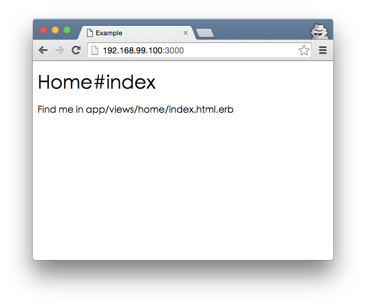

# 写码道场 #

## 环境准备 ##

我们使用Docker来部署统一的Ruby on Rails开发环境。

首先，根据你的操作系统选择参考 [Windows](https://docs.docker.com/engine/installation/windows/)(7+)、[Mac OS X](https://docs.docker.com/mac/step_one/)或[Linux](https://docs.docker.com/linux/step_one/)文档，安装好Docker。

然后执行下面命令创建开发用的镜像（以Mac OS X为例）：

```
#######################
# 启动Docker
#######################
$ docker-machine create --driver virtualbox default
$ docker-machine env default
$ eval "$(docker-machine env default)"


#######################
# 获取开发使用的镜像
#######################
$ docker pull gaoermai/ruby-devel:0.0.2
$ docker tag gaoermai/ruby-devel:0.0.2 dojo/ruby-devel:latest


#######################
# 启动容器
#######################
$ mkdir ~/dojo ; cd ~/dojo
$ git clone https://github.com/gaoermai/coding-dojo.git
$ ./coding-dojo/bin/for_mac/start_devel
```

至此，整个环境的部署已经完成，并且已经进入容器。

我们做一下简单的测试，看看是否一切正常。在容器中执行：

```
# cd demo_app/
# rake
```

如果你看到下面输出，说明RSpec和Cucumber的测试能够正常运行了：

```
/usr/local/bin/ruby -I/usr/local/bundle/gems/rspec-core-3.3.2/lib:/usr/local/bundle/gems/rspec-support-3.3.0/lib /usr/local/bundle/gems/rspec-core-3.3.2/exe/rspec --pattern spec/\*\*\{,/\*/\*\*\}/\*_spec.rb
No examples found.


Finished in 0.00055 seconds (files took 0.61756 seconds to load)
0 examples, 0 failures

/usr/local/bin/ruby -S bundle exec cucumber  --profile default
Running via Spring preloader in process 19402
Using the default profile...
0 scenarios
0 steps
0m0.001s
```

打开浏览器输入```http://192.168.99.100:3000/```，你会看到以下界面：



如果你不知道IP，可以通过命令```docker-machine ip default```获得。

## 编辑器 ##

建议使用RubyMine，从[Jetbrains官方网站](https://www.jetbrains.com/ruby/download/)可以下载到最新的30天试用版本。